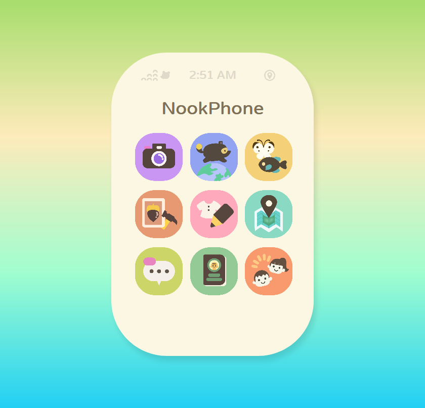

# NookPhone
A remake of the NookPhone UI from Animal Crossing New Horizons

## What is it?
This is a simple remake of the NookPhone home screen UI written in HTML/CSS/JavaScript. It is just a design mockup and **does not** function like the NookPhone in any fashion, as in the app icons are just there for show and clicking them will not enter any new context.

## What is the JavaScript for?
There is a small amount of JavaScript used for setting the clock and changing the app name when different apps are hovered over. The animations and design are otherwise completely HTML/CSS based.

## Assets
The app icons are from [this](https://imgur.com/t/animalcrossingnewhorizons/jeZHQZL) imgur album which seem to be based directly on the NookPhone icons in the Animal Crossing New Horizons game. The status bar icons are also modeled after the in-game icons. As such, while you are welcome to use this source code in any way you wish as per the MIT license included, the assets in the "images" folder are under the respective copyrights of their creators including Nintendo of America Inc.
